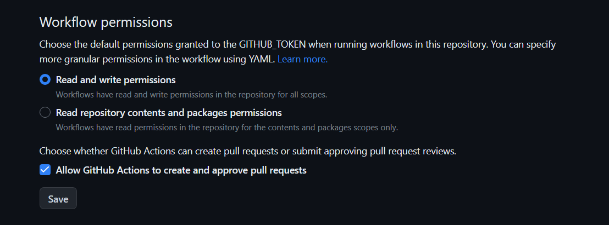

# Siyuan Plugin Template - Vite & Vue3

[English](./README.md)

> 本例同 [siyuan/plugin-sample](https://github.com/siyuan-note/plugin-sample).

1. 使用 Vite 打包
2. 使用 Vue3 进行开发
3. 提供一个github action 模板，能自动生成package.zip并上传到新版本中
4. 提供自动更新 `plugin.json` 中的 `version` 并发布新版本的脚本。[link](#release-script)

> [!NOTE]
>
> 在开始之前，你需要先安装 [NodeJS](https://nodejs.org/en/download) 和 [pnpm](https://pnpm.io/installation)。

## 开始

1. 通过 `Use the template` 按钮，以该仓库为模板创建你自己的项目。
> [!WARNING]
>
> 请注意库名和插件名称一致，默认分支必须为 `main`.

> [!WARNING]
>
> 初次尝试，请不要修改任何内容，直接通过下述方式，成功在思源里加载插件模板以后，再进行调整。
>
> 例如删除 README_zh_CN.md 也会导致插件加载不成功。


2. 使用 `git clone` 克隆创建好的仓库。
3. 使用 `pnpm i` 安装项目所需的依赖。

4. 复制 `.env.example` 文件并取名为 `.env`，修改其中的 `VITE_SIYUAN_WORKSPACE_PATH` 为你的思源工作空间。


> [!TIP]
>
> 如果你不喜欢将项目打包至工作空间中，可以使用 `软链接` 的方式。
>
> 直接写入思源空间下，可通过思源的同步功能直接同步至其他设备，而软链接的方式则不会参与同步。
> 
> 本模板不提供软链接的具体内容，相关内容可参考 [plugin-sample-vite-svelte](https://github.com/siyuan-note/plugin-sample-vite-svelte)。
> 


5. 使用 `pnpm dev` 启动项目，看到类似下面的内容表示构建成功

  ```

  > plugin-sample-vite-vue@0.0.1 dev /path/to/your/plugin-sample-vite-vue
  > vite build --watch

  mode=> production
  env=> {
    VITE_SIYUAN_WORKSPACE_PATH: '/path/to/siyuan/workspace',
  }

  Siyuan workspace path is set:
  /path/to/siyuan/workspace

  Plugin will build to:
  # ✅ 插件将会构建至下面的位置
  /path/to/siyuan/workspace/data/plugins/plugin-sample-vite-vue

  isWatch=> true
  distDir=> /path/to/siyuan/workspace/data/plugins/plugin-sample-vite-vue
  vite v6.3.5 building for production...

  watching for file changes...

  build started...
  ✓ 26 modules transformed.
  rendering chunks (1)...LiveReload enabled
  ../../Siyuan-plugin/data/plugins/plugin-sample-vite-vue/index.css    1.08 kB │ gzip:  0.41 kB
  ../../Siyuan-plugin/data/plugins/plugin-sample-vite-vue/index.js   198.60 kB │ gzip: 46.59 kB
  [vite-plugin-static-copy] Copied 7 items.
  built in 502ms.
  ```

   刷新思源，你将会在 `思源 - 设置 - 集市` 中看到名为 `plugin-sample-vite-vue` 的插件。
   
6. 启用插件, 并检查 `App.vue` 文件进行开发。

   这个文件中包含了一些代码示例。


> [!TIP]
>
> 更多的插件代码案例，请查看： [siyuan/plugin-sample/src/index.ts](https://github.com/siyuan-note/plugin-sample/blob/main/src/index.ts)


## 上架集市

### 使用 Github Action

1. 你可以在本地使用插件的版本创建一个名为 `v*` 的 tag。
2. 将创建好的 tag 推送至 Github。模板项目提供了 Action 脚本自动构建新版本。


> [!TIP]
>
> <div id="release-script"></div>这个项目提供了自动创建 `tag` 并发布新版本的脚本，你可以通过运行 `pnpm release` 创建一个修正版本。
>
> 你可以通过使用参数 `--mode=manual|patch|minor|major` 设置版本号的调整模式，或者通过 `pnpm release:manual` 的方式直接以特定参数进行发布。
>
> 完整的命令列表请查看 `package.json` 文件。


样例中自带了 github action，可以自动打包发布，请遵循以下操作：

1. 设置项目 `https://github.com/OWNER/REPO/settings/actions` 页面向下划到 Workflow Permissions，打开配置



2. 需要发布版本的时候，push 一个格式为 `v*` 的 tag，github 就会自动打包发布 release（包括 package.zip）
3. 默认使用保守策略进行 pre-release 发布，如果觉得没有必要，可以更改 release.yml 中的设置：

```yaml
- name: Release
    uses: ncipollo/release-action@v1
    with.
        allowUpdates: true
        artifactErrorsFailBuild: true
        artifacts: 'package.zip'
        token: ${{ secrets.GITHUB_TOKEN }}
        prerelease: true # change this to false
```

### 手动发布

1. 使用 `pnpm build` 构建 `package.zip`
2. 在 GitHub 上创建一个新的发布，使用插件版本号作为 “Tag version”，示例: https://github.com/siyuan-note/plugin-sample/releases
3. 上传 package.zip 作为二进制附件
4. 提交发布

> [!NOTE]
> 
> 如果是第一次发布版本，还需要创建一个 PR 到 [Community Bazaar](https://github.com/siyuan-note/bazaar)  社区集市仓库，修改该库的 plugins.json。该文件是所有社区插件库的索引，格式为：

```json
{
  "repos": [
    "username/reponame"
  ]
}
```

---

更多有关于插件的信息，请查看： [siyuan/plugin-sample](https://github.com/siyuan-note/plugin-sample).
